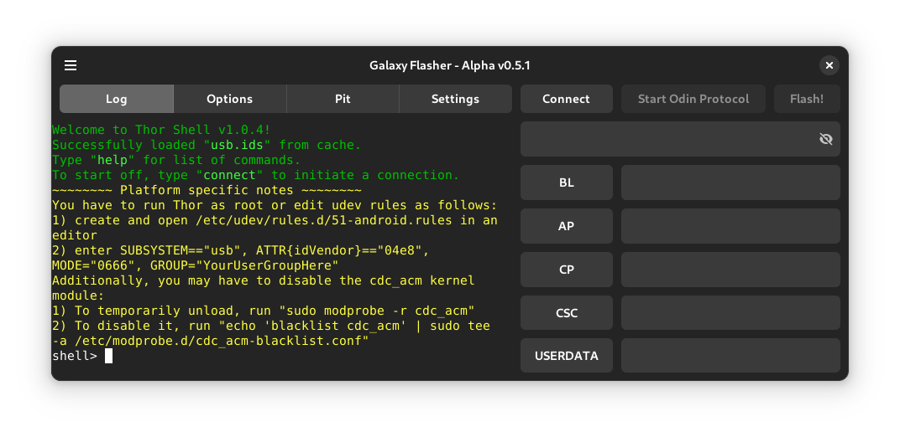

Log Tab
=======

.. image:: _static/galaxy-flasher-light.png
   :alt: A screenshot of the Log Tab.
   :class: only-light

The Log Tab displays the output from the flash-tool.
You are also able to enter flash-tool commands into the Log Tab, just as you would in the terminal.
