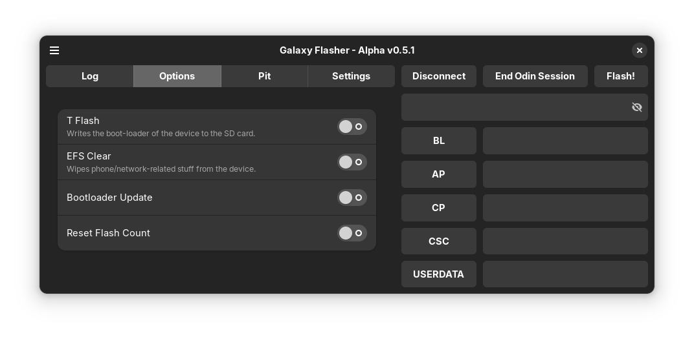

Options Tab
===========

The Options Tab is where you can set flash-tool specific options.

For Thor, the options are:
  
* T Flash - Writes the boot-loader of a working device to the SD card.
* EFS Clear - Wipes phone/network-related stuff from your device. It should NOT be used by normal users.
* Bootloader Update - I honestly have no idea what this does. Let me know if you do!
* Reset Flash Count - I believe this does what it sounds like it does, but I don't know when you'd ever use it. Please correct me if I'm wrong!

Keep in mind that setting options through the Log Tab is buggy currently, and you need to start an Odin session before you can set any options.

For Odin4, there are currently no options.
The "-V", "Validate home binary with pit file" option might be added if someone can tell me what it does.
