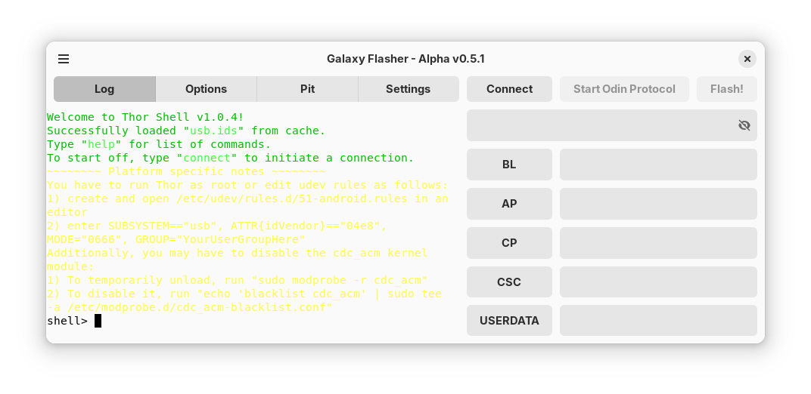

Usage
=====

Galaxy Flasher's layout is similar to Odin:

.. image:: _static/galaxy-flasher-dark.png
   :alt: A screenshot of Galaxy Flasher.
   :class: only-dark

In the upper-right there are four buttons: "Log", "Options", "Pit", and "Settings". Clicking these buttons will change what "tab" you are viewing. All four tabs are described :doc:`here <tabs>`.

On the right side you will see five rows that each have a button and an entry. That is where you can :doc:`select files <selecting-files>`.

For how to flash files, :doc:`look here <flashing-files>`.

The entry above the file selection buttons/entries is the :doc:`Command Entry <command-entry>`.

.. toctree::
   :maxdepth: 2

   tabs
   selecting-files
   flashing-files
   command-entry
